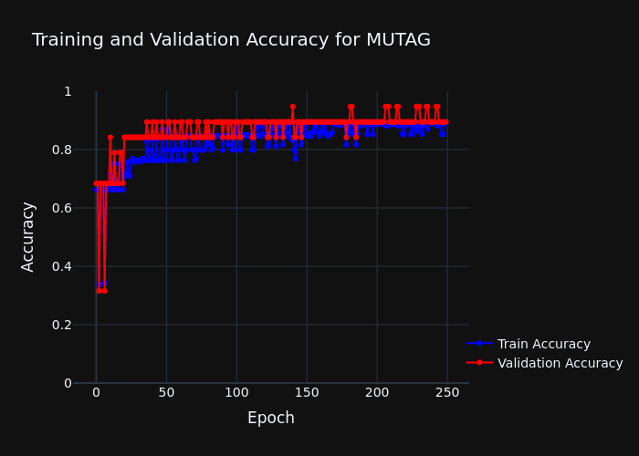
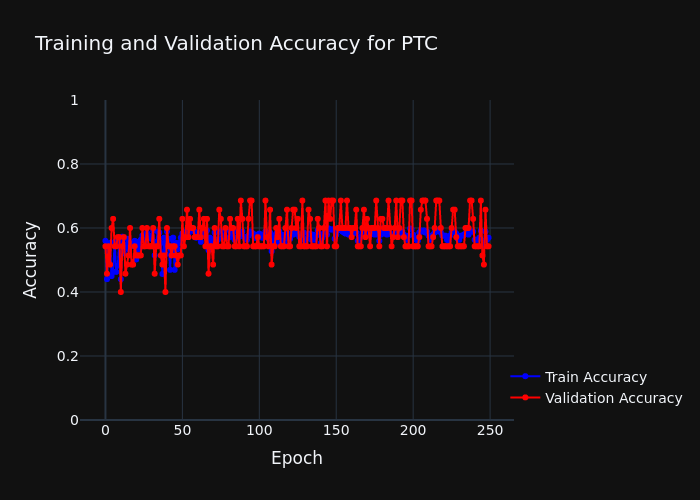
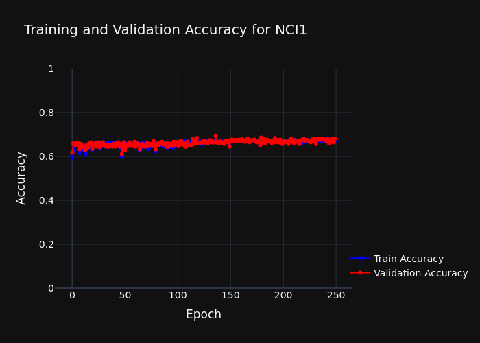
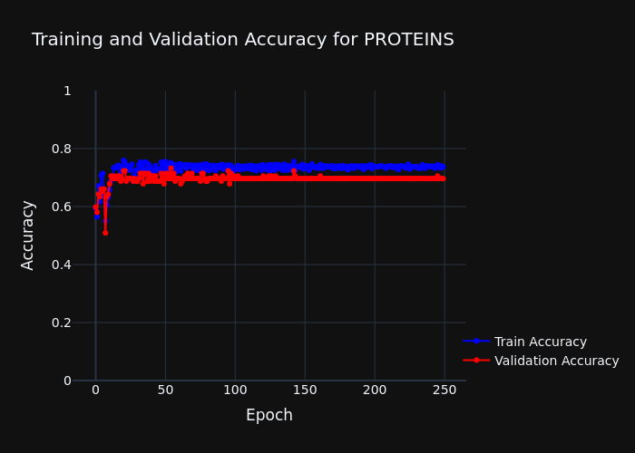
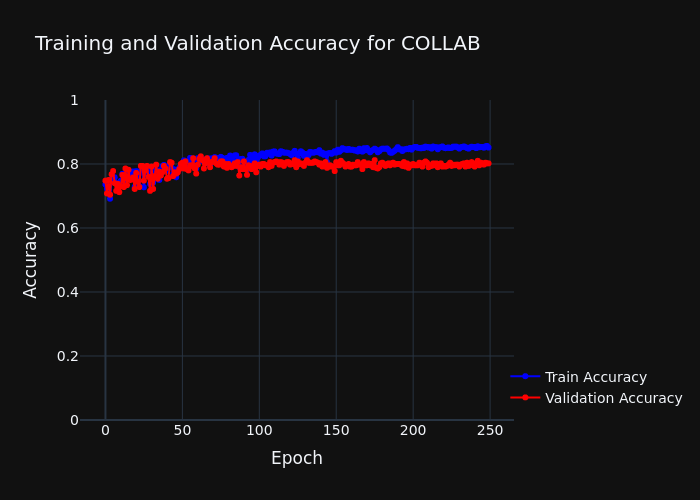
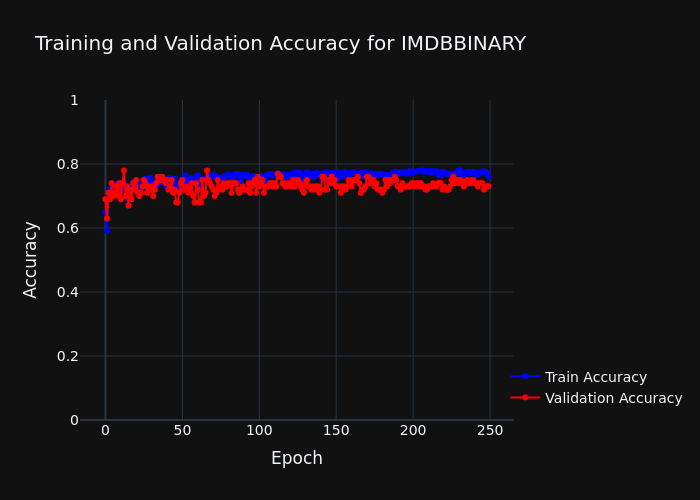
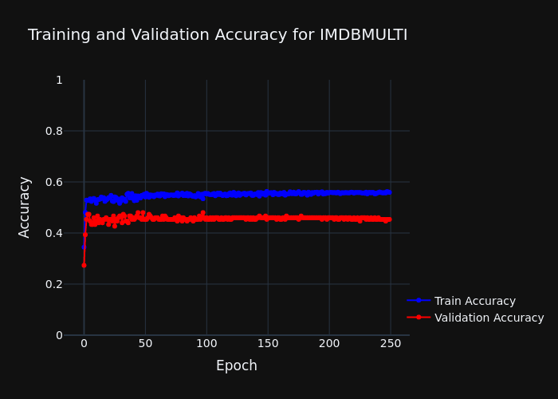
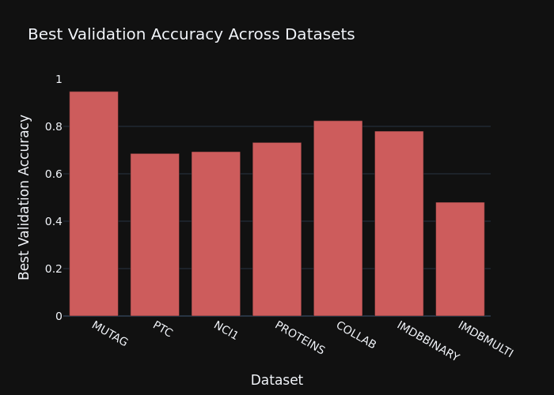

# Graph Isomorphism Network (GIN) Training and Evaluation

This project implements a Graph Isomorphism Network (GIN) for graph classification tasks using the DGL library. The model is trained and evaluated on various graph datasets, and the training and validation accuracies are plotted for analysis.

## Datasets

The following datasets are supported:
- MUTAG
- PTC
- NCI1
- PROTEINS
- COLLAB
- IMDBBINARY
- IMDBMULTI

## Usage

To train the model on a specific dataset, run the following command:

```bash
python main.py --dataset <DATASET_NAME>
```

Replace `<DATASET_NAME>` with one of the supported dataset names.

To enable plotting of training and validation accuracy, add the `--plot` flag:

```bash
python main.py --dataset <DATASET_NAME> --plot
```

## Plots

### Training and Validation Accuracy

The training and validation accuracies are plotted for each epoch and saved as an image file. The plot shows the accuracy trends over the training process.

### Best Validation Accuracy

The best validation accuracy for each dataset is plotted and saved as an image file. This plot provides a comparison of the model's performance across different datasets.


###  Plots

Here are some example plots generated during the training process:

#### Training and Validation Accuracy for MUTAG


#### Training and Validation Accuracy for PTC


#### Training and Validation Accuracy for NCI1


#### Training and Validation Accuracy for PROTEINS


#### Training and Validation Accuracy for COLLAB


#### Training and Validation Accuracy for IMDBBINARY


#### Training and Validation Accuracy for IMDBMULTI


#### Best Validation Accuracy Across Datasets



## Requirements

- Python 3.x
- DGL
- PyTorch
- NumPy
- scikit-learn
- Plotly

Install the required packages using pip:

```bash
pip install dgl torch numpy scikit-learn plotly
```

## Example

To train the model on the MUTAG dataset  run:

```bash
python main.py --dataset MUTAG
```

To plot the accuracy run:

```bash
python main.py --plot
```
This will generate the following plots:
- `accuracy_plot_MUTAG.png`: Training and validation accuracy for each dataset
- `best_accuracy_plot.png`: Best validation accuracy across all datasets.

## License

This project is licensed under the MIT License.
